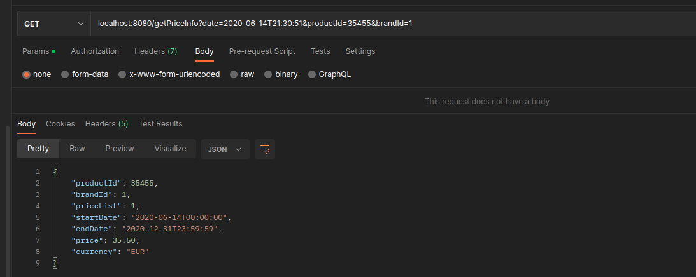

# springboot-service-prices-test
> Este proyecto es un test para inditex , es un servicio en el que dando la marca , id de producto y fecha de aplicación devolvemos el precio que tiene el producto en esa fecha.
>
## Table of Contents
* [Enunciado](#enunciado)
* [Tecnologías](#tecnologías)
* [Arquitectura](#arquitectura)
* [Estructura de proyecto](#estructura-de-proyecto)
* [Instalacion](#instalacion)
* [Test](#test)
* [Conclusiones](#conclusiones)

## Enunciado
En la base de datos de comercio electrónico de la compañía disponemos de la tabla PRICES que refleja el precio final (pvp) y la tarifa que aplica a un producto de una cadena entre unas fechas determinadas. A continuación se muestra un ejemplo de la tabla con los campos relevantes:
 

 
Se pide:
 
Construir una aplicación/servicio en SpringBoot que provea una end point rest de consulta  tal que:
Acepte como parámetros de entrada: fecha de aplicación, identificador de producto, identificador de cadena.
Devuelva como datos de salida: identificador de producto, identificador de cadena, tarifa a aplicar, fechas de aplicación y precio final a aplicar.

Se debe utilizar una base de datos en memoria (tipo h2) e inicializar con los datos del ejemplo, (se pueden cambiar el nombre de los campos y añadir otros nuevos si se quiere, elegir el tipo de dato que se considere adecuado para los mismos).            

Desarrollar unos test al endpoint rest que  validen las siguientes peticiones al servicio con los datos del ejemplo:
                                                                                       
-          Test 1: petición a las 10:00 del día 14 del producto 35455   para la brand 1 (ZARA)
-          Test 2: petición a las 16:00 del día 14 del producto 35455   para la brand 1 (ZARA)
-          Test 3: petición a las 21:00 del día 14 del producto 35455   para la brand 1 (ZARA)
-          Test 4: petición a las 10:00 del día 15 del producto 35455   para la brand 1 (ZARA)
-          Test 5: petición a las 21:00 del día 16 del producto 35455   para la brand 1 (ZARA)
 
 
Se valorará:
 
Diseño y construcción del servicio.
Calidad de Código.
Resultados correctos en los test.

<!-- You don't have to answer all the questions - just the ones relevant to your project. -->

## Tecnologías
- Java 17
- Git
- Spring Boot
- BBDD H2
- Spring data - JPA
- Lombok
- Modelmapper (Tambien se podría utilizar mapstruct)
- Junit
- Mockito
- Jacoco

Utilizamos git como sistema de control de versiones distribuido. Para gestionar nuestro proyecto. Al ser un proyecto sencillo lo gestionamos con la rama main y la develop para el desarrollo del proyecto. Tambien utilizamos una rama en la que creamos los test. Al ser algo sencillo no opte por Git Flow. Aunque así hubiera estado mucho mejor estructurado.

Hemos utilizado Spring Boot ya que nos permite configurar un entorno mas rapidamente y nos facilita toda la configuración.

Elegímos Spring Data JPA ya que simplifica el acceso a bases de datos relacionales en Java, abstrayendo la complejidad de JPA, ofreciendo operaciones CRUD eficientes y permitiendo consultas personalizadas, lo que agiliza el desarrollo.

Lombok nos simplifica la creación de clases mediante anotaciones, generando automáticamente métodos como getters, setters, constructores y facilitando la escritura de código conciso y legible.

JUnit nos facilita la creación y ejecución de pruebas, mientras que Mockito ayuda a simular objetos y comportamientos, permitiendo pruebas aisladas y eficientes.
Tambien hemos utilizado JaCoCo que es una herramienta de cobertura de código. Proporciona informes detallados sobre qué partes del código fuente están cubiertas por pruebas unitarias, ayudando a mejorar la calidad del software.

## Arquitectura

En este proyecto hemos utilizado una arquitectura hexagonal, también conocida como "Puertos y Adaptadores", por las siguientes razones:

#### Separación de Responsabilidades
- Claridad en la separación entre la lógica de negocio y los detalles de implementación.
- Facilita el mantenimiento y la evolución del código al evitar dependencias directas.

#### Flexibilidad y Adaptabilidad
- Permite cambios en los detalles de implementación sin afectar la lógica de negocio.
- Facilita la adaptación a nuevas tecnologías o entornos sin un gran impacto en el código existente.

#### Pruebas Unitarias Aisladamente
- Aísla la lógica de negocio de los detalles de implementación, facilitando pruebas más enfocadas y menos propensas a errores.

#### Reutilización de Componentes
- La capa de dominio independiente fomenta la reutilización de componentes.
- Facilita la incorporación de nuevas características sin afectar las existentes.

#### Mejora de la Mantenibilidad
- Estructura clara y modular para facilitar la identificación y corrección de problemas.
- Mejora la capacidad para incorporar nuevas funcionalidades.

#### Adopción de Principios SOLID
- Sigue los principios SOLID, promoviendo prácticas de desarrollo sólidas.
- Mejora la calidad del diseño del software y la capacidad para enfrentar cambios en los requisitos.

Esta elección proporciona una base sólida para el desarrollo y mantenimiento eficiente del proyecto.

## Estructura de proyecto

- **com.rizquierdo.servicepricestest**
  - **infraestructure**
    - **persistence**
      - **repository**
        - `JpaPriceRepository.java`: Repositorio JPA para interactuar con la base de datos.
      - **entity**
        - `PriceEntity.java`: Representación de entidad para precios en la base de datos.
        - `BrandEntity.java`: Representación de entidad para marcas en la base de datos.
    - **mapper**
      - `ModelMapperConfig.java`: Configuración de un mapeador .
    - **rest**
      - **dto**
        - `ErrorDto.java`: Objeto de transferencia de datos para representar errores.
        - `PriceDto.java`: Objeto de transferencia de datos para representar información de precios.
      - **controllers**
        - `PriceController.java`: Controlador que maneja las solicitudes HTTP relacionadas con precios.
      - **advice**
        - `GlobalExceptionHandler.java`: Manejador global de excepciones para personalizar respuestas en caso de errores.
  - **domain**
    - **model**
      - `Brand.java`: Clase que representa un modelo de dominio relacionado con la marca.
      - `Price.java`: Clase que representa un modelo de dominio relacionado con el precio.
  - **application**
    - **usecases**
      - `PriceService.java`: Interfaz que define casos de uso relacionados con los precios.
    - **service**
      - `PriceServiceImpl.java`: Implementación de la interfaz `PriceService` con la lógica de aplicación relacionada con los precios.
  - `ServicePricesTestApplication.java`: Clase principal de la aplicación Spring Boot que inicia la aplicación.

## Instalacion

El proyecto esta compilado con java 17. Por lo que se necesitara tener instalado el JKD 17 o compatible. 
Y añadirlo al JAVA_HOME para compilar correctamente.

Para lanzar los test seria lanzando:

`./mvnw test`

Para lanzar los test con jacoco report :

`./mvnw clean test jacoco:report`

Los informes te lo dejara en la ruta del proyecto en target/site:

`cd ./springboot-service-prices-test/target/site`

Y para levantar el servicio.

`./mvnw spring-boot:run`

Un ejemplo de request GET sería localhost:8080/getPriceInfo?date=2020-06-14T21:30:51&productId=35455&brandId=1

## Test

Aqui os dejo una breve explicacion de los test implementados en PriceControllerIntegrationTest con los que hemos cubierto el 72% de lineas de codigo (Faltan por cubrir algunos campos del dominio ya que nos estamos utilizando). He hecho unos test de integracion con @SpringBootTest y configurando automaticamente el  MockMvc con  @AutoConfigureMockMvc. Y ahi he ido haciendo los siguientes test haciendo las llamadas GET a nuestro PriceController. 
(Pueden faltar algun test para probar mas excepciones o fallos pero he hecho los mas importantes)

- `testIntegration_14_June_10_00()`: Test de integración que se ejecuta el 14 de junio a las 10:00.
- `testIntegration_14_June_16_00()`: Test de integración que se ejecuta el 14 de junio a las 16:00.
- `testIntegration_14_June_21_00()`: Test de integración que se ejecuta el 14 de junio a las 21:00.
- `testIntegration_15_June_10_00()`: Test de integración que se ejecuta el 15 de junio a las 10:00.
- `testIntegration_16_June_21_00()`: Test de integración que se ejecuta el 16 de junio a las 21:00 PM.
- `testIntegrationWithoutProductId()`: Test que verifica el comportamiento cuando no se proporciona un ID de producto.
- `testIntegrationWithoutDate()`: Test que verifica el comportamiento cuando no se proporciona una fecha.
- `testIntegrationProductIdNotExist()`: Test que verifica el comportamiento cuando el ID de producto no existe.
- `testIntegrationWithoutBrandId()`: Test que verifica el comportamiento cuando no se proporciona un ID de marca.

## Conclusiones
Era un test sencillo con un rest en el que recuperamos el precio según una fecha y teniendo en cuenta la prioridad.
He utilizado los principios SOLID , con una arquitectura hexagonal en el que busco separar la lógica de negocio del entorno externo (separacion por capas), permitiendo una fácil adaptabilidad y pruebas automatizadas. 
Es un servicio muy simple pero siempre hay que tener en cuenta que un proyecto puede crecer posteriormente y esta arqutiectura aporta mucha flexibilidad y facil mantenimiento.

Luego he ido utilizando diferentes patrones de diseño como el patron de servicio , repositorio , mvc , dto,singleton (con spring), inyeccion de dependencias, el builder.

Es un proyecto sencillo como para añadirle mucho más. Quízas añadirle logs y trazearlo mas.

## Contact
Created by rizquierdo.
